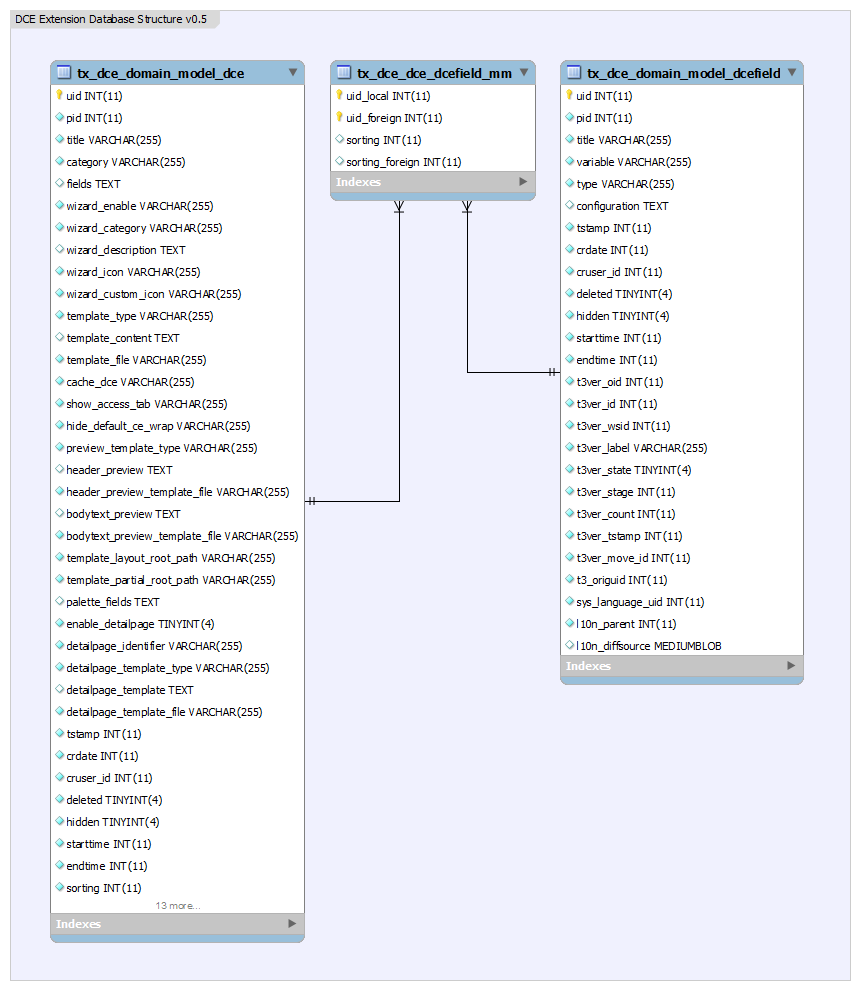
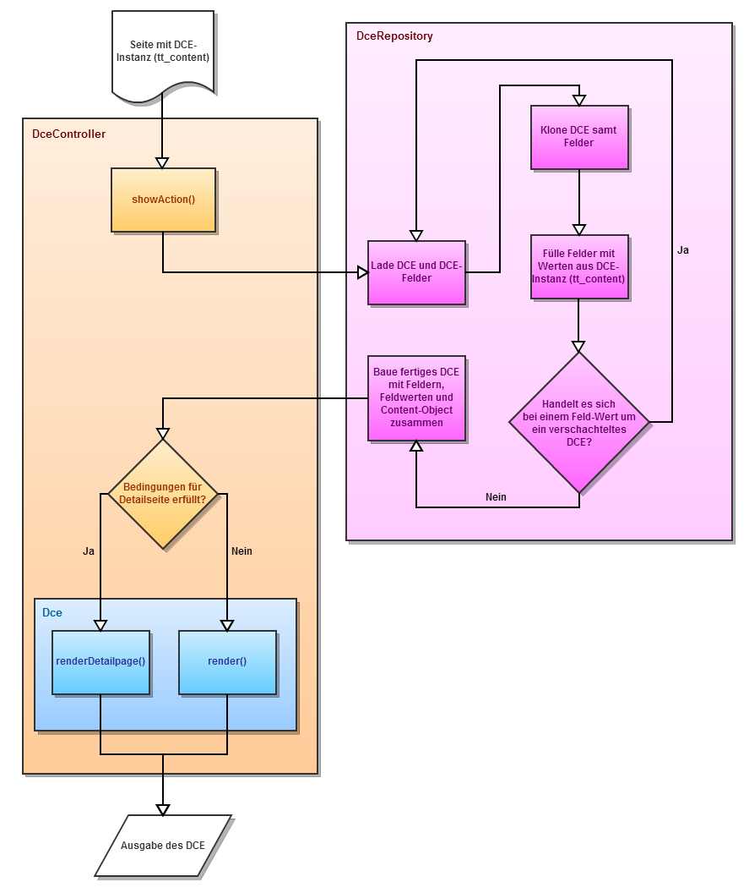

.. ==================================================
.. FOR YOUR INFORMATION
.. --------------------------------------------------
.. -*- coding: utf-8 -*- with BOM.

.. include:: ../Includes.txt

.. _admin-manual:

Administrator manual
====================

Installation
------------

Using the DCE Extension is free of charge and is liable to the GNU Lesser General Public License.

When the extension is downloaded/imported it reside in the subdirectory /typo3conf/ext/ and can be installed with the extension manager.

During the installation three tables are created and also the configuration cache is cleared.

After finishing the installation some configuration options are available, which can be executed directly inside the extension manager. The options have an effect globally for the extension and all DCEs.

Configure Extension dce
^^^^^^^^^^^^^^^^^^^^^^^

Successive all options are listed that can be configured for the DCE extension in the extension manager.

.. image:: ../Images/AdministratorManual/extensionConfiguration3.png
	:alt: DCE Extension configuration

Disable automatic clear cache
"""""""""""""""""""""""""""""

If enabled, the TYPO3 cache (all) will not get cleared automatically on changes of DCE. This option is not recommended.

Disable CodeMirror
""""""""""""""""""

A very helpful feature of the DCE extension is the included CodeMirror editor. This is a syntax highlighting editor implemented in JavaScript which increase the value of the input fields of the DCE field configuration and the fluid templates. Activating this option deactivates the CodeMirror editor. That also results in removing the dropdown above the input fields.

Disable preview autoupdate
""""""""""""""""""""""""""

If enabled the preview texts of existing content elements based on DCE, are not getting updated automatically when the DCE changed. A link in preview text will be displayed to update the texts manually with ajax. This is not recommended, use it only when having problems.

Enable update check
""""""""""""""""""""

Enables update check: If enabled the backend module contains a check if there are new DCE versions available. This requires to send some data to the update server. Check the :doc:`/PrivacyPolicy/Index` for further informations.

DCE Popup Link in DCE instance (content element)
------------------------------------------------

Since version 0.5 a new button is shown in the upper area when editing a DCE instance.

.. image:: ../Images/AdministratorManual/popupLinkButton.png
	:alt: DCE Popup Link in DCE instance (content element).

This button (the rightmost in the image above) is only visible for administrators. Pressing this button opens a popup to edit the DCE directly. If the popup is closed with the TYPO3 own buttons the DCE instance is updated and shows directly the changes. That also mean that all changes made to the DCE instance that were not saved are lost.

Mode of operation
-----------------

The operation mode of the DCE extension is extensive in some areas. You should read this chapter carefully to understand the technology behind DCE.

Class diagram
^^^^^^^^^^^^^

The following class diagram shows the two DCE classes (in orange):

1. Tx_Dce_Domain_Model_Dce
2. Tx_Dce_Domain_Model_DceField

and other classes that are directly involved, in a simple representation. Extbase classes are shown in gray and purple for PHP own interfaces.

.. image:: ../Images/AdministratorManual/classDiagram.png
	:alt: Class diagram

Database structure
^^^^^^^^^^^^^^^^^^

During the installation of the DCE extension two tables are automatically created:

1. tx_dce_domain_model_dce
2. tx_dce_domain_model_dcefield

They correspond with the domain models of the class diagram. This is a standard of Extbase.

Instead of MM-tables DCE uses the "parent_dce" and "parent_field" field to map fields to dces and to other fields (for section fields).

DCE rendering sequence
^^^^^^^^^^^^^^^^^^^^^^

The following sequence diagram shows rough which steps are pass through when a DCE instance is rendered.

At first the showAction of the DceController is called. These gets a data record of the content object. The CType contains the uid of the DCE. The values for the various fields of the DCE were readout of the column pi_flexform as Flexform XML.

At first in the DceRepository based on the uid the DCE and all associated DCE fields are loaded. At the moment they does not contain any values. In the next step the DCE and its fields are cloned. That is a necessity in Extbase, if you will avoid that the object is automatically updated and saved in the database at the end of the action.

The now following function is very complex and fills every single DCE field with the corresponding values. This function not only fills bullish the value property of a DCE field, but rather calculates these dependent of its configuration.

For example, if you have defined a field as type *Group* and allowed there the selection of Tx_News_Domain_Model_News (EXT:news) than the DCE extension loads not only a comma seperated list of uids in the field value but the finished news objects with all their dependencies, in case of discover the corresponding repository.

With a non Extbase extension, like tt_news, an array with the corresponding values is delivered instead.

This behaviour has to be activated with a special command in the XML configuration of the field.

It is also possible to group DCEs into each other. When this is the case the complete process starts over for the included DCE. Because this is implemented recursive any much of DCEs can be nested into each other.

When the complete DCE is assembled it will be rendered in the showAction of the DceController. The rendering itself is running inside the DCE. That is new since version 0.5 and allows to access the rendering of referenced DCEs inside the Fluid template.

Also new with 0.5 is the so called detail view. That is an alternative display of a template dependent on a given GET parameter that can also be defined in the DCE configuration.

Caching
^^^^^^^

Backend Cache
"""""""""""""

In order that the DCE can be used in the TYPO3 backend correspondent entries must exist in the ext_localconf.php and ext_tables.php.

For this purpose the DCE extension has its own caching, that behaves like the system cache. In the directory typo3temp two new files are cached:

1. /typo3temp/Cache/Code/cache_dce/ext_localconf.php
2. /typo3temp/Cache/Code/cache_dce/ext_tables.php

These files are automatically deleted when the system cache is cleared. The system cache must be activated in install or be enabled by setting development environment.

Furthermore the DCE cache is cleared by every saving of a DCE. With this the changes of a DCE (e.g. add a new field) are directly shown in the backend. This behavior can be disabled by a setting in the extension (with the extension manager).

By the way: For the creation of the DCE cache the Fluid template engine is used, which now creates PHP and XML code instead of HTML code according of the settings that was made in the DCE.

Frontend Cache
""""""""""""""

In the frontend the common TYPO3 mechanism are used to cache the output. In the settings of a DCE the cache of the showAction() of the DceController can be disabled for each single DCE, if wanted.
