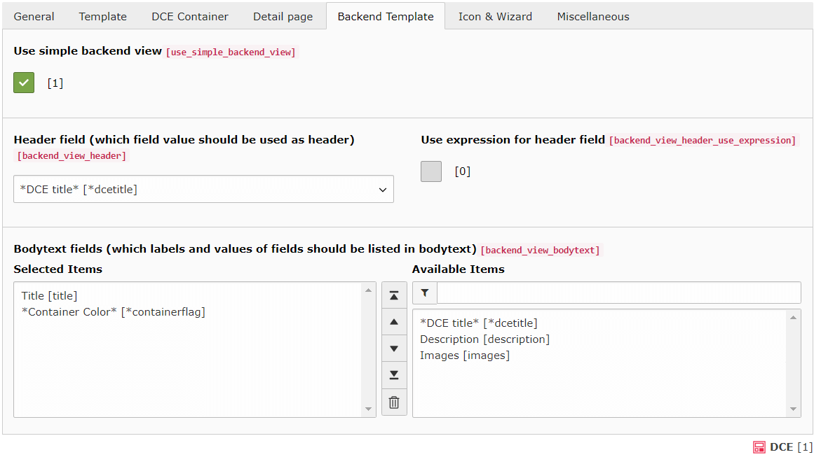
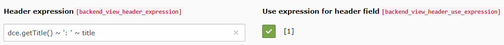

.. include:: ../Includes.txt

.. _users-manual-backendtemplate:

Backend Template
----------------

Each DCE has not only a template for the frontend output, but also for the backend output. Without a backend template
you will not be able to see differences in your content elements, in the page or list view.

DCE provides two ways to set up the backend template:

- Simple Backend View and
- Manual Backend Fluid template

Simple Backend View
===================

The Simple Backend View allows you to define fields you want to display, just by clicking it.

This example looks like this in backend:

.. image:: Images/dce-container-in-backend.png
   :alt: DCE Container when Simple Backend View is enabled

.. _users-manual-backendtemplate_header_expression:

Expression for header field
~~~~~~~~~~~~~~~~~~~~~~~~~~~

Since DCE 2.7 you can enable a checkbox, which reveals an input field. There you can use Symfony Expressions to
output more than one field in content element's header.

.. tip::
   The header is also used as label (in list view and select dropdowns).

This header expression will - for example - generate the following header: **Teaser: My second teaser**

.. note::
   On this page, you see how Symfony expressions in DCE work: :ref:`additional-informations-dce-expression-utility`

PageTS configuration
~~~~~~~~~~~~~~~~~~~~

You can make some adjustments here, using PageTS:

.. code-block:: typoscript

    tx_dce.defaults {
        simpleBackendView {
            titleCropLength = 10
            titleCropAppendix = ...

            imageWidth = 50c
            imageHeight = 50c

            containerGroupColors {
                10 = #0079BF
                # ...
            }
        }
    }

Manual Backend Fluid Template
=============================

When you disable the Simple Backend View, you can enter (or reference to a file) a template using the "BackendTemplate"
Fluid layout, which has two sections: **header** and **bodytext**

.. code-block:: html

    <f:layout name="BackendTemplate" />

    <f:section name="header">
        <strong>{dce.title}</strong> 
    </f:section>
    <f:section name="bodytext">
        Your backend template goes here...
    </f:section>

.. note::
   Currently, it is not possible to access to DCE container info in manual backend template.
