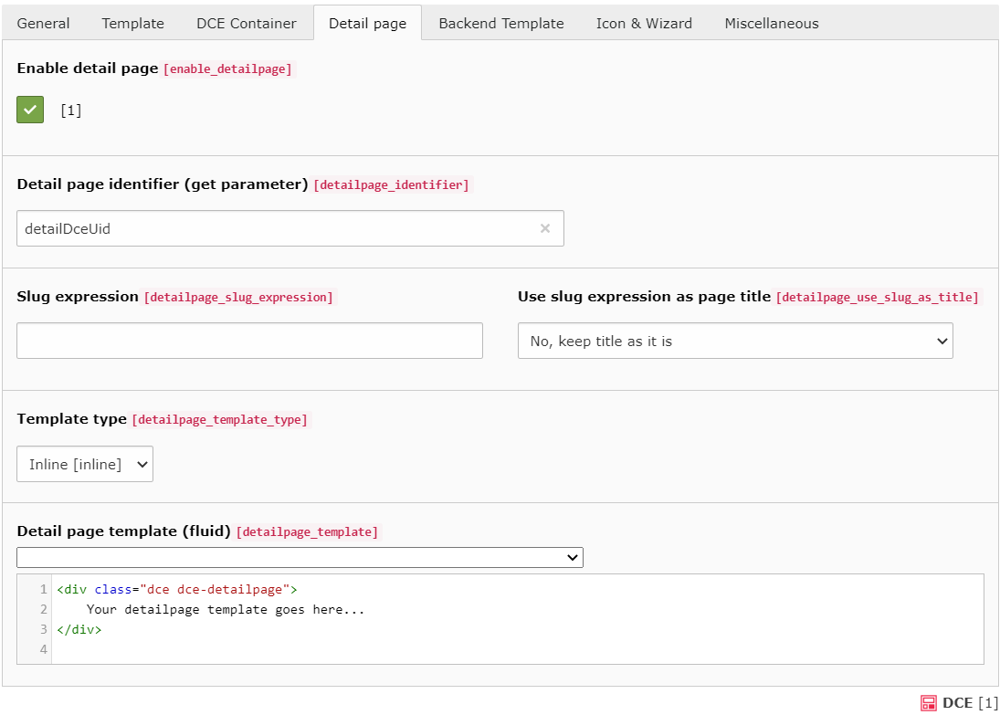

.. include:: ../Includes.txt

.. _users-manual-detailpage:

Detail page
-----------

The detail page can be used to display the fields of the DCE in another manner. For example, if you have many fields
defined for your DCE you can display the most important fields with the normal template
and the complete amount of fields with the detail template.

The decision to display either the normal template or the detail page template is done by detecting the
**detail page identifier** (GET parameter). If it is found and it contains the ``uid`` of the actually shown DCE, the
content is rendered with the detail page template otherwise the normal template is used.

.. important::
   When detail page template rendering is triggered, this has no effect on other content elements on the current page!

Enable detail page
^^^^^^^^^^^^^^^^^^

To enable the functionality for using a detail page you have to check this option.

Detail page identifier (GET parameter)
^^^^^^^^^^^^^^^^^^^^^^^^^^^^^^^^^^^^^^

This is the parameter which must be used in the GET parameter of the URL to enable the display of the detail page.
The value of this GET parameter must be the ``uid`` of the displayed content object, to trigger the detail page template.

You should avoid using a parameter name, which is already in use, like "id", "type" or "L".

.. _users-manual-detailpage-slug-expression:

Slug expression
^^^^^^^^^^^^^^^

Since DCE 2.6.0 a detail page can have a beautiful URL, thanks to TYPO3's routing enhancer, available since TYPO3 v9.
This slug expression field controls how the slug is being build.

You can choose a single field or multiple, thanks to Symfony's expression language.

.. note::
   On this page, you see how Symfony expressions in DCE work: :ref:`additional-informations-dce-expression-utility`

.. important::
   All slugs generated by DCE are sanitized. The only chars allowed are ``a-z``, ``0-9`` and ``-``.
   All other chars, get replaced by dash ``-``. Double dashes are trimmed to one dash.

A registered :ref:`routing enhancer configuration <additional-informations-faking-detail-pages-installation>`
is required, to use this feature. There is a dedicated chapter for this, checkout
:ref:`Faking detail pages <additional-informations-faking-detail-pages>`.

.. _users-manual-detailpage-title-expression:

Pagetitle expression
^^^^^^^^^^^^^^^^^^^^

Here you can do the exact same thing, as in **slug expression** field, but this expression is used for the
pagetitle of the detail page.

..  _users-manual-detailpage-use-title:

Use slug expression as page title
^^^^^^^^^^^^^^^^^^^^^^^^^^^^^^^^^

With this option enabled, the current page title gets modified, based on the given slug expression.
In opposite to slugs itself, generated DCE detail page titles are not sanitized (e.g. convert spaces to dashes).

**You can choose between four options:**

1. No, keep title as it is (default)
2. Yes, overwrite the current page title
3. Yes, prepend slug content to current page title
4. Yes, append slug content to current page title

When selecting "prepend" (3) or "append" (4), the generated DCE detail page title gets separated by a configurable
string. By default it separates the DCE and the page title by ``' - '``.

You can configure this by TypoScript, this is the default configuration DCE ships:

::

    config.pageTitleProviders.dce {
        prependWrap = || - |
        appendWrap = | - ||
    }

Those values are used in a stdWrap `noTrimWrap <https://docs.typo3.org/m/typo3/reference-typoscript/master/en-us/Functions/Stdwrap.html#notrimwrap>`_
function.

Template type
^^^^^^^^^^^^^

Like the *normal* template you can choose between the inline template code and using a template file.

Detail page template (Fluid)
^^^^^^^^^^^^^^^^^^^^^^^^^^^^

Using the inline template type you have to insert the template code in the same manner as for the normal template.

How to create a link to detail template
~~~~~~~~~~~~~~~~~~~~~~~~~~~~~~~~~~~~~~~

In your "normal" template you probably want a link, to trigger the detail template for this content element.
Actually, it is pretty easy to create such a link in Fluid template:

.. code-block:: html

    <f:link.page additionalParams="{detailDceUid:contentObject.uid}">
        Show detail template of this content element
    </f:link.page>

.. note::
   It is not possible to activate two content element detail pages at once.

Helpful links
^^^^^^^^^^^^^

- :ref:`additional-informations-faking-detail-pages-tips-hide`
- :ref:`additional-informations-faking-detail-pages-tips-xml`
