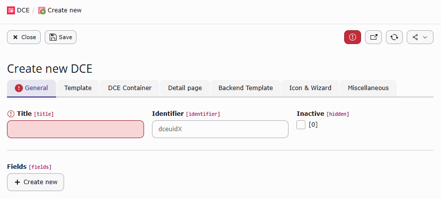
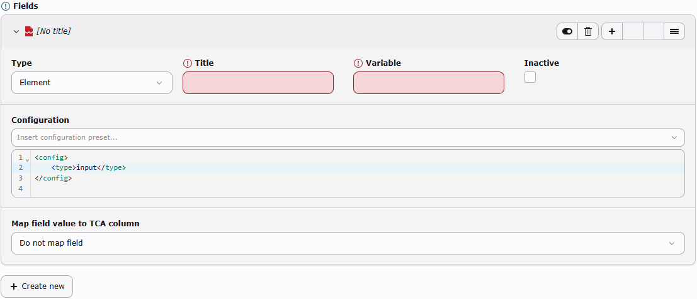
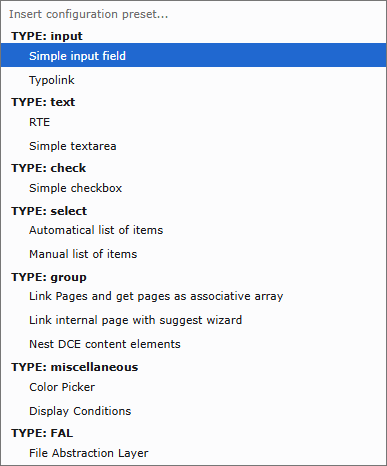
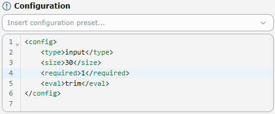

.. _users-manual-general:

General
-------

On this tab, you can make the general settings. You can decide whether the element is visible or not, give it a
meaningful name and identifier and define all the fields that are needed.

Title
^^^^^

This is the name of the DCE, which is also shown in the type selection of a content element.
You can point to LLL: references here and translate the title for different languages.

Identifier
^^^^^^^^^^

The identifier is used to generate the CType for content elements based on this DCE. Enter the identifier without the
``dce_`` prefix. For example, the identifier ``what_ever`` generates the CType ``dce_what_ever``. When the identifier
remains empty, DCE generates ``dce_dceuid<uid>``. The identifier must be lowercase; underscores are allowed.

Examples for values entered in the identifier field: ``teaser`` or ``what_ever``.

Inactive
^^^^^^^^

When the DCE is inactive or hidden, it is not shown as the type when a content element is created.
It is only shown in the DCE BE module.

Fields
^^^^^^

In the fields section, you can add a number of different fields that this DCE should contain.
A DCE can be saved without fields, but no usable CType or TCA registration is generated until it contains at least one
active field.

A field has three types available:

- **Element**
  This is a field in your new content element, like a text field, a checkbox, an image or a
  whole rich text editor (RTE). The composition for this field is done in the configuration.
  You can use field types and options supported by TYPO3 FlexForm data structures.
- **Tab**
  This creates a new tab register. All fields that are defined below this tab are shown in BE on a new tab page.
  You may also rename the first "General" tab by creating a tab as the first item.
- **Section**
  **It is highly encouraged to not use sections anymore!**
  Check if DCE Container can help you or use EXT:container for your purposes.

Common to all types is the *title* field, where you define a speaking label for the editor.
You can use an ``LLL:`` reference here. A *Tab* also has a required variable, which is used as its FlexForm sheet
identifier, and can be marked as inactive.

.. caution::
   When you add/update tabs and/or rearrange fields, the FlexForm structure changes!
   Already existing content elements with FlexForm data, need to get migrated, afterwards.

Field options
+++++++++++++

For the default type *Element* you have to define a **title** (with ``LLL:`` support) and a **variable** name which is
to be used in the Fluid template. Variable names have to be written in **lowerCamelCase** and the variable names must
be unique inside each DCE.

.. note::
   The configuration for the fields is stored in **FlexForm (XML)** format. Look for ``<el>`` in the FlexForms section
   of the `T3DataStructure <https://docs.typo3.org/m/typo3/reference-coreapi/main/en-us/ApiOverview/DataFormats/T3datastructure/Index.html>`_
   documentation to get detailed information for the definition of the field configuration.

To make it a bit easier there is a handy select box provided with the most used possible input field types.
If you select one entry the corresponding FlexForm XML code is inserted in the configuration input field.

For fields which use the TCA types **group**, **select**, **inline** or **file**, there are additional configuration attributes
provided by DCE available.

dce_load_schema
~~~~~~~~~~~~~~~

.. code-block:: xml

    <dce_load_schema>1</dce_load_schema>

When adding a group field and link it with e.g. News (by Georg Ringer), then the field contains a comma-delimited list
with uids of the selected news. That is not very useful in Fluid templates.

But when this attribute is activated, the used table is inspected. If an Extbase model and repository exist for this
table then the repository is instantiated and a ``findByUid()`` is called for every ``uid``. The complete Extbase models are
then taken over to the Fluid template (as an array).

If the table is not part of an Extbase extension, the corresponding record is loaded from the database and handed
over as an associated array.

.. note::
   Automatic Extbase model and repository resolution is intended for one table. Group fields containing records from
   multiple tables can be resolved by the associative-array fallback when their stored values contain the table name.

Using the table tt_content and adding content elements which are based on another DCE, automatically the
corresponding DCE will be loaded and filled. In the template of the second DCE the template of the inserted DCE can be
called and rendered:

.. code-block:: html

    <f:for each="{field.otherDces}" as="otherDce">
        {otherDce.render -> f:format.raw()}
    </f:for>

You need to use the raw view helper of Fluid because otherwise the rendered HTML will be escaped.
If you use the ``f:format.html`` view helper the curly braces get escaped and variables will not be interpreted anymore.

It is also possible to access directly the value of single fields:

.. code-block:: html

    {otherDce.get.fieldName}

dce_load_entity_class
~~~~~~~~~~~~~~~~~~~~~

.. code-block:: xml

    <dce_load_entity_class>VendorName\Extension\Domain\Model\YourModel</dce_load_entity_class>

Uses this class (and its repository) instead of guessing the model class name from table name.

dce_get_fal_objects
~~~~~~~~~~~~~~~~~~~

.. code-block:: xml

    <dce_get_fal_objects>1</dce_get_fal_objects>

This option is evaluated while schema loading is active, so both ``dce_load_schema`` and ``dce_get_fal_objects`` are
required. A field with ``type=file`` or a relation to ``sys_file_reference`` returns an array of
``TYPO3\CMS\Core\Resource\FileReference`` objects. A relation to ``sys_file`` returns an array of
``TYPO3\CMS\Core\Resource\File`` objects.

dce_ignore_enablefields
~~~~~~~~~~~~~~~~~~~~~~~

.. code-block:: xml

    <dce_ignore_enablefields>1</dce_ignore_enablefields>

For records loaded through DCE's associative-array database fallback, this option removes restrictions for fields such
as deleted, hidden, starttime and endtime. It does not change the query settings of an Extbase repository.

dce_enable_autotranslation
~~~~~~~~~~~~~~~~~~~~~~~~~~

.. code-block:: xml

    <dce_enable_autotranslation>1</dce_enable_autotranslation>

If you load a page via group field, then always this page is loaded, regardless of the language that is just used.
Using this attribute shows the translated page if it exists.

For pages, DCE uses TYPO3's ``getPageOverlay()`` handling. For other records, it uses ``getLanguageOverlay()``.

.. _users-manual-general-skip-translation:

dce_skip_translation
~~~~~~~~~~~~~~~~~~~~

.. code-block:: xml

    <dce_skip_translation>1</dce_skip_translation>

When a DCE field got this option set, DCE fields act like ``l10n_mode => 'exclude'`` in TCA. Normally FlexForms does
not support this behaviour.

In backend, a field with this option set is only visible, when:

- You are on default language (``sys_language_uid = 0``) **or**
- the translated DCE content element has no ``l18n_parent`` set

To achieve this, DCE modifies the displayCond for the field, in XML configuration - when you already defined some
display conditions, they get merged (using ``<and>``).

In frontend, the field value will get overwritten by the field value of the ``l18n_parent``-element, no matter which values
are stored in pi_flexform.

This feature is not supported for section fields.

Special Thanks to **Silverback** (https://silverback.st/) who sponsored this feature!
