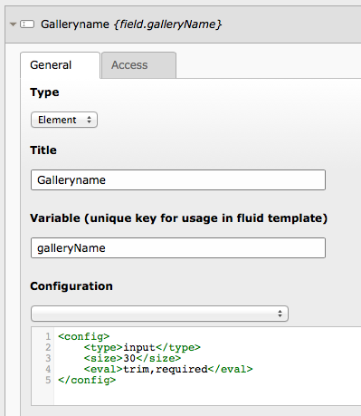
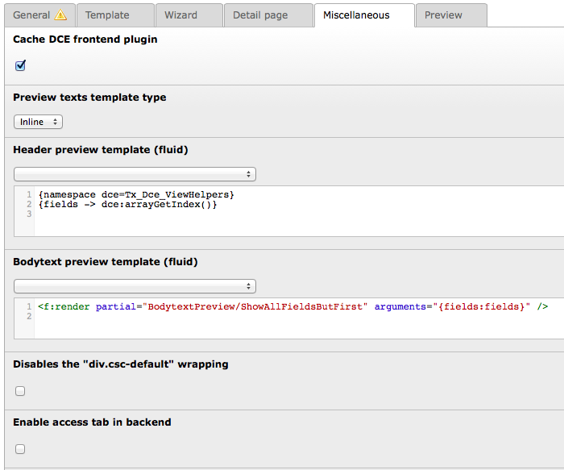

.. ==================================================
.. FOR YOUR INFORMATION
.. --------------------------------------------------
.. -*- coding: utf-8 -*- with BOM.

.. include:: ../Includes.txt

.. _users-manual:

Users manual
============

At the beginning we will show you a short example, followed by a complete description of the settings that are possible for a DCE.

Tutorial
--------

We will create a content element with a title, a description and a list of images with a normal view showing the title and the first image and a detail view with the title, the description and the complete list of images.

Create a DCE
^^^^^^^^^^^^

There are two options to create a new DCE. You can go to DCE backend module that you will find in the Admin Tools or go to the root page (id=0) in list view, which needs administrator privileges, and create a new "DCE" record. Some actions like deleting DCEs are currently not possible in backend module, but in list view.

When you have created the DCE enter "Gallery element" for the title.

Now create a new field, choose the type *Element* and enter "Galleryname" as title. As variable you have to enter the name in lower camel case, name it "galleryName". For the configuration choose the option "Simple input field" from the select list box, this fills the text box below the select box with the configuration for an input field.

Create another new field, choose the type *Element* and enter "Description" as title and "description" as variable name. As configuration select "Full RTE" from the list box.

.. figure:: ../Images/UsersManual/fieldDescription.png
	:alt: Definition of field Description

Next create a new field with title "Pictures" and variable name "pictures". As configuration you have to select "File Abstraction Layer" of the type "Inline". In line 8 of the configuration you see the marker *<!-- Name of variable! -->*. Replace thisVariableName with the variable name of this field ("pictures").

.. figure:: ../Images/UsersManual/fieldPictures.png
	:alt: Definition of field Pictures

Save the changes. This is necessary for the next steps.

.. figure:: ../Images/UsersManual/newDceGalleryElement.png
	:alt: New DCE Gallery Element

Now go to the template tab, you will see a default template in the "Template content (fluid)" text box.

::

	{namespace dce=Tx_Dce_ViewHelpers}
	<f:layout name="Default" />

	<f:section name="main">
		Your template goes here...
	</f:section>

Replace the text "Your template goes here..." with the fluid code to display the title, the first image and a link to the detail view.

::

	{namespace dce=Tx_Dce_ViewHelpers}
	<f:layout name="Default" />

	<f:section name="main">
		Gallery: {field.galleryName} 
		 
		<f:for each="{dce:fal(field:'pictures', contentObject:contentObject)}" as="fileReference" iteration="iterator">
			<f:if condition="{iterator.isFirst}">
				<f:image src="{fileReference.uid}" alt="" treatIdAsReference="1" width="200px"/>
			</f:if>
		</f:for>
		 
		<f:link.page pageUid="{page.uid}" additionalParams="{detailUid: '{contentObject.uid}'}">Detail</f:link.page>
		

	</f:section>

The select box helps you to create the fluid template. When you select an entry from the select box the corresponding code is inserted at the actual cursor position. So it is easy to insert the correct variable names into the fluid template.

Go to the "Detail page" and enable the check box "Enable detail page". In the field "Detail page identifier (get parameter)" you have to enter "detailUid".

The complete "Detail page template (fluid)" should be this:

::

	{namespace dce=Tx_Dce_ViewHelpers}
	<f:layout name="Default" />

	<f:section name="main">
		Gallery: {field.galleryName} 
		Description: 
		<f:format.html>{field.description}</f:format.html> 
		Pictures:  
		<f:for each="{dce:fal(field:'pictures', contentObject:contentObject)}" as="fileReference" iteration="iterator">
			<f:image src="{fileReference.uid}" alt="" treatIdAsReference="1" width="200px"/>
		</f:for>
		 
		<f:link.page pageUid="{page.uid}">Back</f:link.page>
	</f:section>

After saving your new content element, it is ready to use (even for content editors). It is always located in the CTYPE-dropdown box of new tt_content items. It is also possible to add an option to the create page content wizard, you have to enable the option "Show DCE in content element Wizard" on the wizard tab sheet for this integration.

Reference
---------

Every option you can set while creating or modifying a DCE is described here in detail. Mandatory fields are signed by a yellow triangle. At least these fields have to be filled out.

General
^^^^^^^

On this tab you can made the general settings. You can decide whether the element is visible or not, give it a meaningful name and define all the fields that are needed.

.. figure:: ../Images/UsersManual/newDceEmpty.png
	:alt: Create new DCE, general tab

Hide
""""

When the DCE ist hidden, it is not shown as type when a content element is created. It is only shown in the DCE BE module.

Title
"""""

This is the name of the DCE, that is also shown in the type selection of a content element.

Fields
""""""

In the fields section you can add a number of different fields that this DCE should contain. You have to add at least one field. There are different field types possible to offer the possibility for creating complex content elements.

**Element:** This is a content element, like a text field, a check box, an image or a whole RTE. The composition for this content element is done in the configuration.
**Tab:** This is a tab register. All fields that are defined below this tab are shown in BE on a tab page.
**Section:** With a selection you collect elements to groups which belongs together.

Common to all types is the *title* field, where you define a speaking label for the editor. For the type *Tab* there are no more options to define.

Element
+++++++

For the type *Element* you have to define a variable name which is to be used in the fluid template. Variable names have to be written in **lowerCamelCase** and the variable names must be unique inside a single DCE.

Following cases can be checked by validators and corrected on demand:

* The field is required (required)
* The field must not start or end with a space (trim)
* The field can only contain following characters: [a-zA-Z0-9] (is_in)
* The field should not begin with a letter (tx_dce_formevals_noLeadingNumber)
* The field must be correspond to the lowerCamelCase convention (tx_dce_formevals_lowerCamelCase)

The configuration for the fields is stored in Flexform (XML) format. Look for TCEforms in the Flexforms section of the :ref:`T3DataStructure <t3api:t3ds>` documentation to get detailed information for the definition of the field configuration. To make it a bit easier there is a select box with some of the most used possible input field types. If you select one entry the corresponding Flexform XML code is inserted in the configuration input field.

For fields of the types group, select or inline, there are additional configuration attributes available. These attributes are boolean values, that are activated with a value of 1.

**dce_load_schema**

::

	<dce_load_schema>1</dce_load_schema>

When adding a group field and link it with News (by Georg Ringer), than the field contains a comma delimited list with uid's of the selected news. That is not very useful in Fluid templates. But if this attribute is activated than the used table is inspected. If an Extbase model and repository exists for this table, than the repository is instantiated and a *findByUid()* is called for every uid. The complete Extbase models are than taken over to the Fluid template. If the table is not part of an Extbase extension than the corresponding record is loaded from the database and handed over as an associated array.

This function works only with one table, if you configure more tables it dos not work. The `issue 47541`_ covers this behavior in forge.

.. _issue 47541: http://forge.typo3.org/issues/47541

Using the table tt_content and adding content elements which are based on an other DCE, automatically the corresponding DCE will be loaded and filled. In the template of the second DCE the template of the inserted DCE can be called and rendered.

::

	<f:for each="{field.otherDces}" as="othersDce">
		{otherDce.render -> f:format.raw()}
	</f:for>

You need to use the raw viewhelper of fluid, because otherwise the rendered html will be escaped. If you use the f:format.html() viewhelper the curly braces get escaped and variables will not be interpreted anymore.

It is also possible to access directly the value of single fields:

::

	{otherDce.fieldname}

**dce_get_fal_objects**

::

	<dce_get_fal_objects>1</dce_get_fal_objects>

If you have defined a FAL field and this attribute is activated, the value is directly replaced with a TYPO3\CMS\Core\Resource\File object from the repository. Than it is needless to use the FAL ViewHelper in the Fluid template.

**dce_ignore_enablefields**

::

	<dce_ignore_enablefields>1</dce_ignore_enablefields>

Setting this attribute ignores the enablefields of the requested table. All enablefields like deleted, hidden, starttime, endtime were than ignored. This can be used for outputting hidden records.

**dce_enable_autotranslation**

::

	<dce_enable_autotranslation>1</dce_enable_autotranslation>

If you load a page via group field than always this page is loaded, regardless of the language that is just used. Using this attribute shows the translated page if it exists ($GLOBALS['TSFE']->sys_page->getPageOverlay()). That also works with other records, not only with records of the pages table, than getRecordOverlay() will be used.

TODO: Describe all included field configurations.

Section
+++++++

TODO: Describe "Section fields tag (singular)"

For the type *Section* you have to define a variable name which is to be used in the fluid template. Variable names have to be written in **lowerCamelCase** and the variable names must be unique inside a single DCE.

For a section you can define as many fields you like. The section fields can contain fields of the types element, tab or section. You can create very complex BE input forms with the combination of the 3 field types.

Template
^^^^^^^^

On this tab you define the template which is used for displaying the content of the DCE in the FE. You can use the full power of fluid at this place.

Template type
"""""""""""""

Inline
++++++

The default template type *Inline* let you directly edit the content of the fluid template inside the text area of the "Template content (fluid)" entry field.

.. figure:: ../Images/UsersManual/newDceEmptyTemplate.png
	:alt: Create new DCE, template tab

Lets have a look at the default template code and explain the parts.

::

	{namespace dce=Tx_Dce_ViewHelpers}
	<f:layout name="Default" />

	<f:section name="main">
		Your template goes here...
	</f:section>

In the first line the namespace for the DCE ViewHelpers is defined. This should not be removed.

With the 2nd line this individual template is included in the main template "Default". You will find the main template "Default" at this place: *typo3conf/ext/dce/Resources/Private/Layouts/Default.html* wit this content:

::

	

	<f:render section=”main” />
	

If you want to get rid of the div container you can use the layout "None" instead of "Default".

The individual template with all your HTML code and CSS classes must be inside the section "main", it should replace the dummy line 5 ("Your template goes here...").

With the select box in the "Template content (fluid)" section you can insert variables and ViewHelpers into the template. The selected variable or ViewHelper is inserted at the current cursor position in the template.

There are several groups inside the select box.

Available variables
~~~~~~~~~~~~~~~~~~~

This group shows the variable names of all the fields that you have created at the *Global* tab.

Available base variables
~~~~~~~~~~~~~~~~~~~~~~~~

This group contains often used base variables.

+ {dce} - The DCE object
+ {contentObject} -  Content object, this is the DCE instance
+ {TSFE} -  TSFE object, tslib_fe
+ {page} - Properties of the current page
+ {tsSetup} - TypoScript setup of the current page

Famous viewhelper
~~~~~~~~~~~~~~~~~

In this group are the templates of the most used Fluid ViewHelpers. Detailed information about the Fluid ViewHelper you will find in the official `TYPO3 documentation <http://docs.typo3.org/flow/TYPO3FlowDocumentation/stable/TheDefinitiveGuide/PartV/FluidViewHelperReference.html>`_

* f:count
* f:debug
* f:for
* f:format.crop
* f:format.html
* f:if
* f:image
* f:link.email
* f:link.external
* f:link.page
* f:render

DCE viewhelper
~~~~~~~~~~~~~~

**dce:arrayGetIndex**
normally you can access array values with: {array.0}, {array.1}, etc. if they have numeric keys. This ViewHelper converts named keys to numeric ones. Furthermore if you are able to set the index dynamically (i.e. from variable).

**dce:GP**
Gets get or post variables. Never use this ViewHelper for direct output!! This would provoke XSS (Cross site scripting).

**dce:explode**
TODO: Describe ViewHelper

**dce:fal**
TODO: Describe ViewHelper

**dce:format.addcslashes**
TODO: Describe ViewHelper

**dce:format.raw**
use f:format.raw on TYPO3 4.6 or higher

**dce:format.tiny**
Removes tabs and line breaks.

**dce:format.ucfirst**
TODO: Describe ViewHelper

**dce:format.wrapWithCurlyBraces**
Use this ViewHelper if you want to wrap something with curly braces {}.

**dce:image**
Identically like f:image ViewHelper, but works in preview texts too.

**dce:isArray**
Returns TRUE or FALSE, should be used in if conditions.

**dce:thisUrl**
TODO: Describe ViewHelper

**dce:typolink**
TODO: Describe ViewHelper

**dce:typolinkUrl**
TODO: Describe ViewHelper

**dce:uri.dam**
TODO: Describe ViewHelper
(Not supported in sections)

File
++++

The option *File* let you choose a file that contains the fluid content that should be used as the template for this DCE. The file name is selected in the "Template file (fluid)" input field. THis option makes it possible that you put the templates under revision control due to the fact that the files are stored in the file system.

.. figure:: ../Images/UsersManual/newDceEmptyTemplateFile.png
	:alt: Create new DCE, template tab

Wizard
^^^^^^

It is possible to add this DCE to the list of the create content element Wizard.

.. figure:: ../Images/UsersManual/newDceEmptyWizard.png
	:alt: Create new DCE, wizard tab

Show DCE in content element Wizard
""""""""""""""""""""""""""""""""""

When this option is enabled than an entry for this DCE is added to the list of the create content element Wizards.

Wizard category
"""""""""""""""

You can select here in which category of the wizard the DCE should appear. Beside a new category "Dynamic content elements" also the TYPO3 own categories are available.

Wizard description
""""""""""""""""""

THis is a short description text which is shown in the wizard and should describe what is the function of this content element. It can be also be left empty.

Wizard icon
"""""""""""

The icon that is displayed in front of the entry in the wizard list can be choose from a large amount of available icons.

Wizard custom icon (24x24 pixel)
""""""""""""""""""""""""""""""""

If none of the included icons fits your imagination you can also upload an icon in the format PNG or GIF with 24x24 pixel.

Detail page
^^^^^^^^^^^

The detail page can be used to display the fields of the DCE in another manner. For example, if you have many fields defined for your DCE you can display the most important fields with the normal template and the complete amount of fields with the detail template.

The decision to display either the normal template or the detail page template is done by detecting the detail page identifier (get parameter). If it is found and it contains the uid of the actually shown DCE, the content is rendered with the detail page template otherwise the normal template is used.

.. figure:: ../Images/UsersManual/newDceEmptyDetailPage.png
	:alt: Create new DCE, detail page tab

If you have more than one DCE on a page, for example a list of Items, and you select the detail view for one of the items than all items are shown as before and the selected item is shown with the detail view. If you select the detail view of another item than the previous selected item is again shown with the normal template.

It is also possible to create an extra page for displaying the detail view where you load the content of the selected DCE via TypoScript.

Example TypoScript for the detail page using TYPO3 6.2 with installed extension bootstrap_package:

::

	lib.dynamicContent{
	  20 = CONTENT
	  20 {
		table = tt_content
		select {
		  pidInList = ###PID where the DCE reside###
		  uidInList.data = GP:###Identificator###
		  where.insertData = 1
		}
	  }
	}

Enable detail page
""""""""""""""""""

To enable the functionality for using a detail page you have to check this option.

Detail page identifier (get parameter)
""""""""""""""""""""""""""""""""""""""

This is the parameter which must be used in the Get parameter of the URL to enable the display of the detail page. The value must be the uid of the displayed content object. You can use it in a link.page ViewHelper with an additional parameter like this (detailUid is here used as the get parameter): *additionalParams="{detailUid: '{contentObject.uid}'}"*

The {contentObject.uid} is a variable that is available in all Fluid templates. The contentObject is the database entry of the tt_content table which contains our DCE instance. So {contentObject.uid} is the uid of the DCE instance.

Allowed are characters, numbers, minus and underscore [a-zA-Z0-9_\-].

Template type
"""""""""""""

Like the *normal* template you can choose between the inline template code and using a template file.

Detail page template (fluid)
""""""""""""""""""""""""""""

Using the inline template type you have to insert the template code in the same manner like for the normal template (field "Template content (fluid)").

Miscellaneous
^^^^^^^^^^^^^

This tab contains all settings that are too less for an own tab.

.. figure:: ../Images/UsersManual/newDceEmptyMisc2.png
	:alt: Create new DCE, miscellaneous tab

Cache DCE frontend plugin
"""""""""""""""""""""""""

This option activates or deactivates the caching of the DCE in the frontend. Every DCE that should be available in the frontend must be initialized in the localconf.php with calling the method Tx_Extbase_Utility_Extension::configurePlugin(). This option take effect if the showAction of the DceController is cached or non cached.

Preview texts template type
"""""""""""""""""""""""""""

Just as on the tab Template or Detail page there is the possibility given to choose between the Inline and File template. In this case it affects the following two fields, the so called preview templates.

Preview templates (fluid)
"""""""""""""""""""""""""

The backend of TYPO3 shows in the page module per default the fields header and bodytext of a tt_content entry.

While DCEs and the resulting DCE instances have free configurable fields, this corresponds not with the two fields that are displayed in the backend. That means that there is no possible option to differentiate between different DCE instances.

In order that this is still possible, the fields header and bodytext can be filled automatically when a DCE instance is saved. For this the two templates are used. With it the content of the two fields can be freely defined.

For a new DCE the fields are filled as follows:

In the header show the value of the first field that reside in the DCE. The bodytext shows all DCE fields in an unordered list, without the first field, in the format:

::

	Variable name: Variable value

The variable value is shortened if the length exceeds 50 characters.

At this point you can freely define what should be displayed in the backend. That is very helpful if you have a lot of fields defined for a DCE.

The preview texts are automatically created when a DCE instance is saved and can be used at other places via TypoScript.

Another hook take effect if the DCE itself is changed and saved. In this case all instances of this DCE are updated. This can be a problem if many instances of the DCE exists. For this you have an option in the extension configuration to deactivate the preview auto update.

Disables the "div.csc-default" wrapping
"""""""""""""""""""""""""""""""""""""""

This option disables the wrapping of the content element with the *
* which can be sometimes necessary.

Enable access tab in backend
""""""""""""""""""""""""""""

If this option is activated the tab with the access rights is shown in the backend. Here you can define detailed, when the DCE is to be shown and who is allowed to see the DCE.

DCE palette fields
""""""""""""""""""

This is a comma separated list of fields which should be shown in the head area of this DCE in the backend.

The default value is this: sys_language_uid, l18n_parent, colPos, spaceBefore, spaceAfter, section_frame, sectionIndex

Fluid layout and partial root path
""""""""""""""""""""""""""""""""""

The two last fields define for all Fluid templates where to find the layouts and the partials. Layouts and partials can be part of Fluid templates and are used to avoid redundancies and keep the code cleaner.

Preview
^^^^^^^

This tab shows a preview of how this DCE will look in the backend. The preview is at first visible when the DCE is saved at least once.

Because of the temporary database entry without write access, not all functions can be tested in the preview.

.. figure:: ../Images/UsersManual/newDceEmptyPreview.png
	:alt: Create new DCE, preview tab

User conditions
^^^^^^^^^^^^^^^

User conditions can be used in the TypoScript setup.

user_dceOnCurrentPage
"""""""""""""""""""""

This user condition checks if the current page contains a DCE (instance).
Usage in TypoScript:

::

	[userFunc = user_dceOnCurrentPage(42)]

The 42 is a sample for the UID of a DCE type.

FAQ
---

:ref:`users-faq`

Open tasks:
-----------
See all open tasks `here`_ in the forge bug tracker.

.. _here: http://forge.typo3.org/projects/extension-dce/issues?query_id=524

Donate:
-------
If you like the dce extension, feel free to `donate`_ some funds to support further development.

.. _donate: https://www.paypal.com/cgi-bin/webscr?cmd=_s-xclick&hosted_button_id=2DCCULSKFRZFU

If you like the documentation, feel free to give a `donation`_ to the writer of the documentation.

.. _donation: https://www.paypal.com/cgi-bin/webscr?cmd=_s-xclick&hosted_button_id=5SACN567JHK6A
