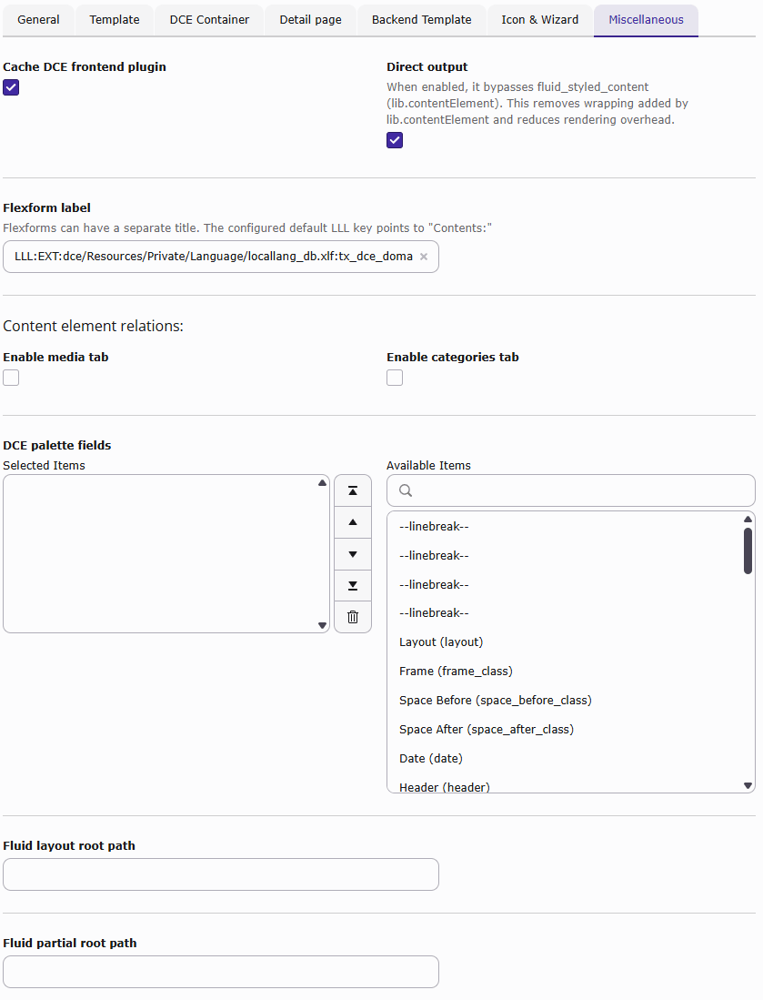
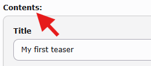

.. _users-manual-miscellaneous:

Miscellaneous
-------------

This tab contains all settings which are difficult to put in a category.

Cache DCE frontend plugin
^^^^^^^^^^^^^^^^^^^^^^^^^

DCE generates the frontend plugin registration automatically when its code cache is rebuilt. This option controls
whether ``DceController::showAction`` is registered as cacheable or non-cacheable for this DCE.

Direct output
^^^^^^^^^^^^^

With this option enabled you bypass ``fluid_styled_content``.
Instead of using lib.contentElement, the DCE controller action is used directly.
This reduces rendering overhead and removes wrappings defined by Fluid Styled Content, for example
``
``.

**This option is enabled by default, separately for each DCE.**

.. note::
   When DCE container feature is enabled the direct output for this DCE is **always** enabled.

FlexForm label
^^^^^^^^^^^^^^

Defines the text displayed in the content element:

Enable media tab in backend
^^^^^^^^^^^^^^^^^^^^^^^^^^^

This option is only available when ``EXT:fluid_styled_content`` is installed. If this option is activated a tab with
media (FAL) field is shown in the backend.

You can access the ``{contentObject.assets}`` or ``{contentObject.media}`` variable in a Fluid template.
It contains an array of ``\TYPO3\CMS\Core\Resource\FileReference``.

Enable categories tab in backend
^^^^^^^^^^^^^^^^^^^^^^^^^^^^^^^^

If this option is activated a tab with category picker is shown in the backend.

You can access ``{contentObject.categories}`` variable in Fluid template.
It contains an array of ``\TYPO3\CMS\Extbase\Domain\Model\Category``.

DCE palette fields
^^^^^^^^^^^^^^^^^^

This is a list of fields which should be shown in the head area of this DCE in the backend.

Fluid layout and partial root path
^^^^^^^^^^^^^^^^^^^^^^^^^^^^^^^^^^

Layouts and partials are a part of Fluid templates and are used to avoid redundancies and keep the code cleaner.

Here you can define Fluid templates folders where to find the layouts and the partials.

With TypoScript you can also set up multiple folder paths for layouts and partials with priority order.
