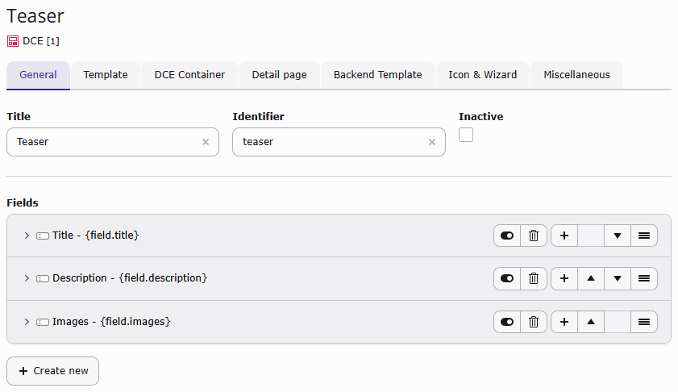
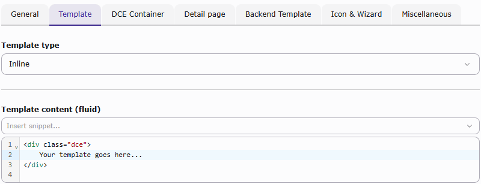

# DCE-Extension for TYPO3

## What is DCE?

DCE is an extension for TYPO3 CMS, which creates easily and fast *dynamic content elements*.
Based on Extbase, Fluid and over 15 years of experience.


### Screenshots






## Installation

DCE requires TYPO3 14.3 or newer within the TYPO3 14 release line, PHP 8.2,
and the PHP extensions DOM and JSON.

You can install DCE in TYPO3 CMS using the [TER](https://extensions.typo3.org/extension/dce/)
or use Composer to fetch DCE from [Packagist](https://packagist.org/packages/t3/dce):

```
composer req t3/dce:"^4.0"
```

If your project uses an older TYPO3 version, install an older, compatible DCE version instead.
Check the available versions and their TYPO3 requirements on
[Packagist](https://packagist.org/packages/t3/dce) or in the
[TYPO3 Extension Repository](https://extensions.typo3.org/extension/dce/).


## Documentation

The full documentation can be found here: https://docs.typo3.org/p/t3/dce/4.0/en-us/


## How to contribute?

Just fork this repository and create a pull request to the **v14** branch.
Please also describe why you've submitted your patch. If you have any questions feel free to contact me.

In case you can't provide code but want to support DCE anyway, here is my [PayPal donation link](https://www.paypal.com/cgi-bin/webscr?cmd=_s-xclick&hosted_button_id=2DCCULSKFRZFU).

**Thanks to all contributors and sponsors!**


## DDEV Environment

DCE ships a [DDEV configuration](https://github.com/a-r-m-i-n/ddev-for-typo3-extensions) with two TYPO3 14.3 installations:

| Mode | Install command | URL |
| --- | --- | --- |
| Composer | `ddev install-v14` | https://v14.dce.ddev.site/ |
| Classic (without Composer) | `ddev install-v14-classic` | https://v14-classic.dce.ddev.site/ |

It uses Apache2 with php-fpm (8.2) enabled.

### Requirements

- Docker
- Docker Compose
- DDEV

### Setup

1. Start the DDEV containers using
    ```
    ddev start
    ```
2. Install both TYPO3 variants using
    ```
    ddev install-all
    ```
   Alternatively, run one of the installation commands listed above to set up
   only the required variant.
3. On https://dce.ddev.site/ you get a brief overview of the environment


### Scripts

Besides the installation scripts, DCE also provides host commands in DDEV, to
render and preview the documentation.

**Render documentation:**
```
ddev docs
```

**Preview rendered documentation:**
```
ddev launch-docs
```
It only opens the browser with the right location. Please render the documentation first.
